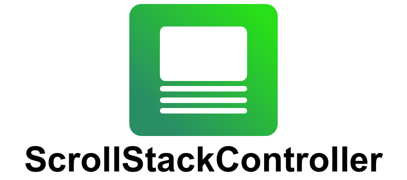
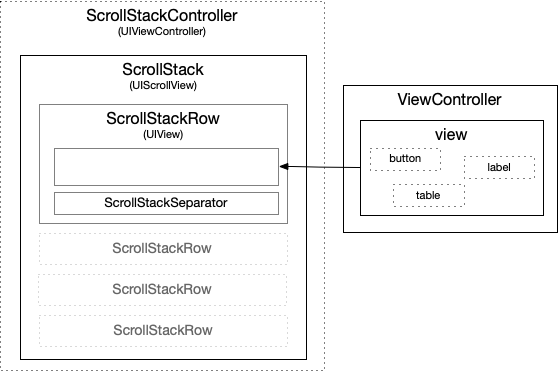
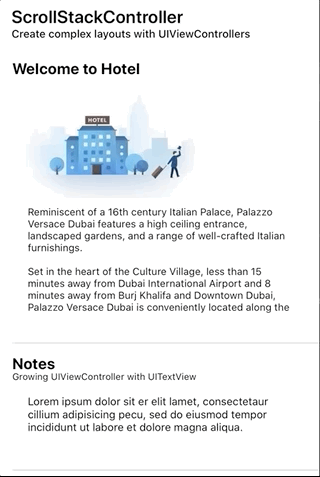

<p align="center" >
  
</p>

<p align="center"><strong>Easy scrollable layouts in UIKit</strong></p>

Create complex scrollable layout using UIViewControllers or plain UIViews and simplify your code!

ScrollStackController is a class you can use to create complex layouts using scrollable `UIStackView` but where each row is handled by a separate `UIViewController`; this allows you to keep a great separation of concerns.

You can think of it as `UITableView` but with several differences:

- **Each row can a different `UIViewController` you can manage independently**: no more massive controllers, a much cleaner and maintainable architecture.
- **You can still use plain `UIView` instances if need a lightweight solution**: this is especially useful when you are using ScrollStackController as layout-helper or your view don't have a complex logic and you can still use the main controller.
- **Powered by AutoLayout since the beginning**; it uses a combination of `UIScrollView + UIStackView` to offer an animation friendly controller ideal for fixed and dynamic row sizing.
- **You don't need to struggle yourself with view recycling**: suppose you have a layout composed by several different screens. There is no need of view recycling but it cause a more difficult managment of the layout. With a simpler and safer APIs set `ScrollStackView` is the ideal way to implement such layouts.


|  	| Features Highlights 	|
|---	|---------------------------------------------------------------------------------	|
| 🕺 	| Create complex layout without the boilerplate required by view recyling of `UICollectionView` or `UITableView`. 	|
| 🧩 	| Simplify your architecture by thinking each screen as a separate-indipendent `UIVIewController`. 	|
| 🧩 	| Support for lightweight mode to layout `UIView` without `UIViewController`. 	|
| 🌈 	| Animate show/hide and resize of rows easily even with custom animations! 	|
| ⏱ 	| Compact code base, less than 1k LOC with no external dependencies. 	|
| 🎯 	| Easy to use and extensible APIs set. 	|
| 🧬 	| It uses standard UIKit components at its core. No magic, just a combination of `UIScrollView`+`UIStackView`. 	|
| 🐦 	| Fully made in Swift 5 from Swift ❥ lovers 	|

## ❤️ Your Support

*Hi fellow developer!*  
You know, maintaing and developing tools consumes resources and time. While I enjoy making them **your support is foundamental to allow me continue its development**.  

If you are using SwiftLocation or any other of my creations please consider the following options:

- [**Make a donation with PayPal**](https://www.paypal.com/paypalme/danielemargutti/20)
- [**Become a Sponsor**](https://github.com/sponsors/malcommac)

- [Follow Me](https://github.com/malcommac)

<a name="index"/>

## Table of Contents

- [When to use `ScrollStackController` and when not](#whentousescrollstackcontrollerandwhennot)
- [How to use it](#howtouseit)
	- [Adding Rows](#addingrows)
	- [Removing / Replacing Rows](#removingreplacingrows)
	- [Move Rows](#moverows)
	- [Hide / Show Rows](#hideshowrows)
	- [Hide / Show Rows with custom animations](#customanimations)
	- [Reload Rows](#reloadrows)
	- [Sizing Rows](#sizingrows)
      - [Fixed Row Size](#fixedrowsize)
		  - [Fitting Layout Row Size](#fittinglayoutrowsize)
		  - [Collapsible Rows](#collapsiblerows)
		  - [Working with dynamic UICollectionView/UITableView/UITextView](#workingwithdynamicuicollectionviewuitableviewuitextview)
  - [Using plain UIViews instead of view controllers](#lightweightplainuiview)
  - [Rows Separator](#rowsseparator)
  - [Tap On Rows](#taponrows)
  - [Get the row/controller](#utilsmethods)
  - [Set Row Insets](#setrowinsets)
  - [Change ScrollStack scrolling axis](#changescrollaxis)
  - [Subscribe to Events](#rowevents)
- [Example App](#exampleapp)
- [Installation](#installation)
- [System Requirements](#systemrequirements)
- [Author & License](#authorlicense)

<a name="whentousescrollstackcontrollerandwhennot"/>

### When to use `ScrollStackController` and when not

`ScrollStackController` is best used for shorter screens with an heterogeneous set of rows: in these cases you don't need to have view recycling.

Thanks to autolayout you will get updates and animations for free.

You can also manage each screen independently with a great separation of concerns; morehover unlike `UITableView` and `UICollectionView`, you can keep strong references to `UIViewController` (and its views) in an `ScrollStack` view and make changes to them at any point.

`ScrollStackController` is not suitable in all situations. 
`ScrollStackController` lays out the entire UI at first time when your screen loads.
If you have a long list of rows you may experience delays.

So, `ScrollStackController` is generally not appropriate for screens that contain many views of the same type, all showing similar data (in these cases you should use `UITableView` or `UICollectionView`).


[↑ Back To Top](#index)

<a name="howtouseit"/>

### How to use it

The main class of the package is `ScrollStack`, a subclass of `UIScrollView`. It manages the layout of each row, animations and keep a strong reference to your rows.

This is an overview of the architecture:



- `ScrollStackController `: is a subclass of `UIViewController`. You would to use it and add as a child controller of your view controller. This allows you to manage any child-controllers related events for each row you will add to the stack controller.
- `ScrollStack`: the view of the `ScrollStackController ` is a `ScrollStack`, a subclass of `UIScrollView` with an `UIStackView` which allows you to manage the layout of the stack. You can access to it via `scrollStack` property of the controller.
- Each row is a `ScrollStackRow`, which is a subclass of `UIView`. Inside there are two views, the `contentView` (a reference to managed `UIViewController`'s `view`) and the `separatorView`. A row strongly reference managed view controller, so you don't need to keep a strong reference by your own.
- Separator view are subclass of `ScrollStackSeparator` class.

As we said, usually you don't want to intantiate a `ScrollStack` control directly but by using the `ScrollStackController` class.
It's a view controller which allows you to get the child view controller's managment for free, so when you add/remove a row to the stack you will get the standard UIViewController events for free!

This is an example of initialization in a view controller:

```swift
class MyViewController: UIViewController {

    private var stackController = ScrollStackViewController()

    override func viewDidLoad() {
        super.viewDidLoad()
        
        stackController.view.frame = contentView.bounds
        contentView.addSubview(stackController.view)
    }
    
}
```

Now you are ready to use the `ScrollStack` control inside the `stackController` class.
`ScrollStack` have an extensible rich set of APIs to manage your layout: add, remove, move, hide or show your rows, including insets and separator management.

Each row managed by `ScrollStack` is a subclass of `ScrollStackRow`: it strongly reference a parent `UIViewController` class where you content is placed. `UIViewController`'s `view` will be the `contentView` of the row itself.

You don't need to handle lifecycle of your rows/view controller until they are part of the rows inside the stack.

To get the list of rows of the stack you can use the `rows` property.

```swift
// Standard methods
let allRows = scrollStack.rows
let isEmpty = scrollStack.isEmpty // true if it does not contains row
let notHiddenRows = scrollStack.rows.filter { !$0.isHidden }

// By Visibility
let currentlyVisibleRows = scrollStack.visibleRows // only currently visible rows (partially or enterly)
let enterlyVisibleRows = scrollStack.enterlyVisibleRows // only enterly visible rows into the stack

// Shortcuts
let firstRow = scrollStack.firstRow
let lastRow = scrollStack.lastRow
```

Let's take a look below.

[↑ Back To Top](#index)

<a name="addingrows"/>

### Adding Rows

`ScrollStack` provides a comprehensive set of methods for managing rows, including inserting rows at the beginning and end, inserting rows above or below other rows.

To add row you can use one the following methods:

- `addRow(controller:at:animated:) -> ScrollStackRow?`
- `addRows(controllers:at:animated:) -> [ScrollStackRow]?`

Both of these methods takes as arguments:

- `controller/s`: one or more `UIViewController` instances; each view of these controllers will be as a row of the stack inside a `ScrollStackRow` (a sort of cell).
- `at`: specify the insertion point. It's an enum with the following options: `top` (at first index), `bottom` (append at the bottom of the list), `atIndex` (specific index), `after` or `below` (after/below a row which contain a specific `UIViewController`).
- `animated`: if true insertion will be animated
- `completion`: completion callback to call at the end of the operation.

The following code add a rows with the view of each view controller passed:

```swift
   let welcomeVC = WelcomeVC.create()
   let tagsVC = TagsVC.create(delegate: self)
   let galleryVC = GalleryVC.create()
        
   stackView.addRows(controllers: [welcomeVC, notesVC, tagsVC, galleryVC], animated: false)
```

As you noticed there is not need to keep a strong reference to any view controller; they are automatically strong referenced by each row created to add them into the stack.

[↑ Back To Top](#index)

<a name="removingreplacingrows"/>

### Removing / Replacing Rows

A similar set of APIs are used to remove existing rows from the stack:

- `removeAllRows(animated:)`: to remove all rows of the stack.
- `removeRow(index:animated:) -> UIViewController?`: to remove a specific row at given index. It returns a reference to removed view controller.
- `removeRows(indexes:animated:) -> [UIViewController]?`: to remove rows at specified indexes from the stack. Removed managed `UIViewController` instances are returned.
- `replaceRow(index:withRow:animated:completion:)`: replace an existing row with a new row which manage new passed view controller.

An example:

```swift
let newVC: UIViewController = ...
stackView.replaceRow(index: 1, withRow: newVC, animated: true) {
	print("Gallery controller is now in place!!")
}
```

[↑ Back To Top](#index)

<a name="moverows"/>

### Move Rows

If you need to adjust the hierarchy of the stack by moving a row from a position to another you can use:

- `moveRow(index:to:animated:completion:)`: move a row at passed inside to another index (both of indexes must be valid).

The following method move the first row at a random position, by animating the transition:

```swift
let randomDst = Int.random(in: 1..<stackView.rows.count)
stackView.moveRow(index: 0, to: randomDst, animated: true, completion: nil)
```

[↑ Back To Top](#index)

<a name="hideshowrows"/>

### Hide / Show Rows

`ScrollStack` uses the power of `UIStackView`: you can show and hide rows easily with a gorgeous animation by using one of the following methods:

- `setRowHidden(index:isHidden:animated:completion:)`: hide or show a row at index.
- `setRowsHidden(indexes:isHidden:animated:completion:)`: hide or show multiple rows at specified indexes.

Example:

```swift
stackView.setRowsHidden(indexes: [0,1,2], isHidden: true, animated: true)
```

Keep in mind: when you hide a rows the row still part of the stack and it's not removed, just hidden! If you get the list of rows by calling `rows` property of the `ScrollStack` you still see it.

[↑ Back To Top](#index)

<a name="customanimations"/>

### Hide / Show Rows with custom animations

You can easily show or hide rows with any custom transition; your view controller just need to be conform to the `ScrollStackRowAnimatable` protocol.  
This protocol defines a set of animation infos (duration, delay, spring etc.) and two events you can override to perform actions:

```swift
public protocol ScrollStackRowAnimatable {
    /// Animation main info.
    var animationInfo: ScrollStackAnimationInfo { get }
    
    /// Animation will start to hide or show the row.
    func willBeginAnimationTransition(toHide: Bool)
    
    /// Animation to hide/show the row did end.
    func didEndAnimationTransition(toHide: Bool)
    
    /// Animation transition.
    func animateTransition(toHide: Bool)
}
```

So for example you can replicate the following animation:



by using the following code:

```swift
extension WelcomeVC: ScrollStackRowAnimatable {
    public var animationInfo: ScrollStackAnimationInfo {
        return ScrollStackAnimationInfo(duration: 1, delay: 0, springDamping: 0.8)
    }

    public func animateTransition(toHide: Bool) {
        switch toHide {
            case true:
                self.view.transform = CGAffineTransform(translationX: -100, y: 0)
                self.view.alpha = 0
            
            case false:
                self.view.transform = .identity
                self.view.alpha = 1
        }
    }
    
    public func willBeginAnimationTransition(toHide: Bool) {
        if toHide == false {
            self.view.transform = CGAffineTransform(translationX: -100, y: 0)
            self.view.alpha = 0
        }
    }
    
}
```

<a name="reloadrows"/>

### Reload Rows

Reload rows method allows you to refresh the layout of the entire stack (using `layoutIfNeeded()`) while you have a chance to update a specific row's `contentView` (aka the view of the managed `UIViewController`).

There are three methods:

- `reloadRow(index:animated:completion:)`: reload a specific row at index.
- `reloadRows(indexes:animated:completion:)`: reload a specific set of rows.
- `reloadAllRows(animated:completion:)`: reload all rows.

If your `UIViewController` implements `ScrollStackContainableController` protocol you will get notified inside the class about this request, so you have the opportunity to refresh your data:

Example:

```swift
class MyViewController: UIViewController {

	private let scrollStackController = ScrollStackController()
	
	@IBAction func someAction() {
		scrollStackController.scrollStack.reloadRow(0)
	}

}

// Your row 0 manages the GalleryVC, so in your GalleryVC implementation:

class GalleryVC: UIViewController, ScrollStackContainableController {

    public func func reloadContentFromStackView(stackView: ScrollStack, row: ScrollStackRow, animated: Bool) {
		// update your UI
	}
	
}
```

[↑ Back To Top](#index)

<a name="sizingrows"/>

### Sizing Rows

You can control the size of your `UIViewController` inside a row of a `ScrollStack` in two ways:

- Creating contrains in your `UIViewController`'s view with Autolayout.
- Implementing `ScrollStackContainableController` protocol in your `UIViewController` class and return a non `nil` value in `scrollStackRowSizeForAxis(:row:in:) -> ScrollStack.ControllerSize?` delegate method.

In both case `ScrollStack` class will use only one dimension depending by the active scroll axis to layout the view controller content into the stack (if scroll axis is `horizontal` you can control only the `height` of the row, if it's `vertical` only the `width`. The other dimension will be the same of the scroll stack itself.

Each of the following cases is covered inside the demo application:

- Fixed row size in [GalleryVC](https://github.com/malcommac/ScrollStackController/blob/master/ScrollStackControllerDemo/Child%20View%20Controllers/GalleryVC.swift)
- Collapsible / Expandable row in [TagsVC](https://github.com/malcommac/ScrollStackController/blob/master/ScrollStackControllerDemo/Child%20View%20Controllers/TagsVC.swift)
- Growing row based on `UITextView`'s content in [NotesVC](https://github.com/malcommac/ScrollStackController/blob/master/ScrollStackControllerDemo/Child%20View%20Controllers/NotesVC.swift)
- Growing row based on `UITableView`'s content in [PricingVC](https://github.com/malcommac/ScrollStackController/blob/master/ScrollStackControllerDemo/Child%20View%20Controllers/PricingVC.swift)

[↑ Back To Top](#index)

<a name="fixedrowsize"/>

### Fixed Row Size

If your view controller has a fixed size you can just return it as follows:

```swift

class GalleryVC: UIViewController, ScrollStackContainableController {

    public func scrollStackRowSizeForAxis(_ axis: NSLayoutConstraint.Axis, row: ScrollStackRow, in stackView: ScrollStack) -> ScrollStack.ControllerSize? {
    	switch axis {
    	case .horizontal:
       	  return .fixed(300)
      	case .vertical:
       	  return .fixed(500)
       }
    }
    
}

```

If your stack support single axis you can obivously avoid switch condition.
When you will add this view controller in a scroll stack it will be sized as you requested (any height/width constraint already in place will be removed).

[↑ Back To Top](#index)

<a name="fittinglayoutrowsize"/>

### Fitting Layout Row Size

Sometimes you may want to have the content view sized by fitting the contents of the view controller's view. In these cases you can use `. fitLayoutForAxis`.

Example:

```swift
public func scrollStackRowSizeForAxis(_ axis: NSLayoutConstraint.Axis, row: ScrollStackRow, in stackView: ScrollStack) -> ScrollStack.ControllerSize? {
	return .fitLayoutForAxis
}
```

`ScrollStack` will use the `systemLayoutSizeFitting()` method on your view controller's view to get the best size to fit the content.

[↑ Back To Top](#index)

<a name="collapsiblerows"/>

### Collapsible Rows

Sometimes you may want to create collapsible rows.
These row can have different heights depending of a variable.

In this case you just need to implement a `isExpanded: Bool` variable in your view controller and return a different height based on it.

```swift

public class TagsVC: UIViewController, ScrollStackContainableController {

    public var isExpanded = false
    
    public func scrollStackRowSizeForAxis(_ axis: NSLayoutConstraint.Axis, row: ScrollStackRow, in stackView: ScrollStack) -> ScrollStack.ControllerSize? {
        return (isExpanded == false ? .fixed(170) : .fixed(170 + collectionView.contentSize.height + 20))
    }
}
```

In your main view controller you may call this:

```swift
	 // get the first row which manages this controller
	 let tagsRow = stackView.firstRowForControllerOfType(TagsVC.self)
	 // or if you have already the instance you can get the row directly
	 // let tagsRow = stackView.rowForController(tagsVCInstance)
	 
	 let tagsVCInstance = (tagsRow.controller as! TagsVC)
	 tagsVCInstance.isExpanded = !tagsVCInstance.isExpanded
	 
	 stackView.reloadRow(tagsRow, animated: true)
```

And your rows will perform a great animation to resize its content.

[↑ Back To Top](#index)

<a name="workingwithdynamicuicollectionviewuitableviewuitextview"/>

### Working with dynamic UICollectionView/UITableView/UITextView

There are some special cases where you may need to resize the row according to the changing content in your view controller's view.

Consider for example an `UIViewController` with a `UITableView` inside; you may want to show the entire table content's as it grown.
In this case you need to make some further changes:

- You need to return `.fitLayoutForAxis`.
- In your view controller's view you need to create a reference to the height constraint of your table.
- You need to create a constraint from the table to the bottom safe area of your view (this will be used by AL to grow the size of the view).

Then you must override the `updateViewConstraints()` to change the value of the table's height constraint to the right value.

This is the code:

```swift

public class PricingVC: UIViewController, ScrollStackContainableController {
    
    public weak var delegate: PricingVCProtocol?
    
    @IBOutlet public var pricingTable: UITableView!
    @IBOutlet public var pricingTableHeightConstraint: NSLayoutConstraint!
    
    public func scrollStackRowSizeForAxis(_ axis: NSLayoutConstraint.Axis, row: ScrollStackRow, in stackView: ScrollStack) -> ScrollStack.ControllerSize? {
        return .fitLayoutForAxis
    }
    
    override public func updateViewConstraints() {
        pricingTableHeightConstraint.constant = pricingTable.contentSize.height // the size of the table as the size of its content
        view.height(constant: nil) // cancel any height constraint already in place in the view
        super.updateViewConstraints()
    }
}
```

In this way as you add new value to the table the size of the row in stack view will grown.

[↑ Back To Top](#index)

<a name="rowsseparator"/>

### Rows Separator

Each row managed by `ScrollStack` is of a subview class of type `ScrollStackRow`. It has a strong referenced to managed `UIViewController` but also have a subview on bottom called `ScrollStackSeparator`.

You can hide/show separators by using the following properties of the row:

- `isSeparatorHidden`: to hide separator.
- `separatorInsets`: to set the insets of the sepatator (by default is set to the same value used by `UITableView` instances)
- `separatorView.color`: to change the color
- `separatorView.thickness`: to se the thickness of the separator (1 by default).

Moreover you can set these values directly on `ScrollStack` controller in order to have a default value for each new row.

`ScrollStack` also have a property called `autoHideLastRowSeparator` to hide the last separator of the stack automatically.

[↑ Back To Top](#index)

<a name="lightweightplainuiview"/>

### Using plain UIViews instead of view controllers

Since version 1.3.x ScrollStack can also be used to layout plain `UIView` instances which not belong to a parent view controllers.  
This is especially useful when you don't have a complex logic in your views and you want to use ScrollStack to make custom layout and keep your code lightweight.

Using plain views is pretty easy; each row method supports both `UIView` or `UIViewController` as parameter.

Since you are working with plain `UIView` instances in order to size it correctly you must set its `heightAnchor` or `widthAncor` (depending of your stack orientation) before adding it to the stack.
As for controllers, `ScrollStack` keeps a strong reference to the managed view which is added as `contentView` of the parent `ScrollStackRow` instance as it happens for `UIViewController`'s `.view` property.

This is a small example:

```swift
let myCustomView = UIView(frame: .zero)
myCustomView.backgroundColor = .green
myCustomView.heightAnchor.constraint(equalToConstant: 300).isActive = true
stackView.addRow(view: myCustomView)
```

<a name="taponrows"/>

### Tap On Rows

By default rows are not tappable but if you need to implement some sort of tap features like in `UITableView` you can add it by setting a default callback for `onTap` property on `ScrollStackRow` instances.

For example:

```swift
scrollStack.firstRow?.onTap = { row in
	// do something on tap
}
```

Once you can set a tap handler you can also provide highlight color for tap.
To do it you must implement `ScrollStackRowHighlightable` protocol in your row managed view controller.

For example:

```swift
class GalleryVC: UIViewController, ScrollStackRowHighlightable {

    public var isHighlightable: Bool {
    	return true
    }
    
    func setIsHighlighted(_ isHighlighted: Bool) {
    	self.view.backgroundColor = (isHighlighted ? .red : .white)
    }

}

```

Transition between highlights state will be animated automatically.

[↑ Back To Top](#index)

<a name="utilsmethods"/>

### Get the row/controller

**Get the (first) row which manage a specific view controller type**
You can get the first row which manage a specific view controller class using `firstRowForControllerOfType<T: UIViewController>(:) -> ScrollStackRow?` function.

```swift
let tagsVC = scrollStack.firstRowForControllerOfType(TagsVC.self) // TagsVC instance
```

**Get the row which manage a specific controller instance**
To get the row associated with a specific controller you can use `rowForController()` function:

```swift
let row = scrollStack.rowForController(tagsVC) // ScrollStackRow
```

<a name="setrowinsets"/>

### Set Row Insets

To set an insets for a specific row you can use `setRowInsets()` function:

```example
let newInsets: UIEdgeInsets = ...
scrollStack.setRowInsets(index: 0, insets: newInsets)
```

You can also use `setRowsInsets()` to set multiple rows.

Moreover by setting `.rowInsets` in your `ScrollStack` class you can set a default insets value for new row added.

<a name="changescrollaxis"/>

### Change ScrollStack scrolling axis

In order to change the axis of scroll for your `ScrollStack` instances you can set the `axis` property to `horizontal` or `vertical.

<a name="rowevents"/>

### Subscribe to Row Events

You can listen when a row is removed or added into the stack view by subscribing the `onChangeRow` property.

```swift
scrollStackView.onChangeRow = { (row, isRemoved) in
  if isRemoved {
    print("Row at index \(row.index) was removed"
  } else {
    print("A new row is added at index: \(row.index). It manages \(type(of: row.controller))")
  }
}
```

You can also subscribe events for events about row visibility state changes by setting the `stackDelegate`. Your destination object must therefore conforms to the `ScrollStackControllerDelegate ` protocol:

Example:

```swift
class ViewController: ScrollStackController, ScrollStackControllerDelegate {
	
  func viewDidLoad() {
    super.viewDidLoad()
    
    self.scrollStack.stackDelegate = self
  }
	
  func scrollStackDidScroll(_ stackView: ScrollStack, offset: CGPoint) {
    // stack did scroll
  }
    
  func scrollStackRowDidBecomeVisible(_ stackView: ScrollStack, row: ScrollStackRow, index: Int, state: ScrollStack.RowVisibility) {
    // Row did become partially or entirely visible.
  }
    
  func scrollStackRowDidBecomeHidden(_ stackView: ScrollStack, row: ScrollStackRow, index: Int, state: ScrollStack.RowVisibility) {
    // Row did become partially or entirely invisible.
  }

  func scrollStackDidUpdateLayout(_ stackView: ScrollStack) {
    // This function is called when layout is updated (added, removed, hide or show one or more rows).
  }

  func scrollStackContentSizeDidChange(_ stackView: ScrollStack, from oldValue: CGSize, to newValue: CGSize) {
    // This function is called when content size of the stack did change (remove/add, hide/show rows).
  }

}
```

`ScrollStack.RowVisibility` is an enum with the following cases:

- `partial`: row is partially visible.
- `entire`: row is entirely visible.
- `hidden`: row is invisible and hidden.
- `offscreen`: row is not hidden but currently offscreen due to scroll position.

[↑ Back To Top](#index)

<a name="systemrequirements"/>

### System Requirements

- iOS 11+
- Xcode 10+
- Swift 5+

[↑ Back To Top](#index)

<a name="exampleapp"/>

### Example App

`ScrollStackController` comes with a demo application which show how easy you can create complex scrollable layoyut and some of the major features of the library.

You should look at it in order to implement your own layout, create dynamically sized rows and dispatch events.

[↑ Back To Top](#index)

<a name="installation"/>

### Installation

`ScrollStackController` can be installed with CocoaPods by adding pod 'ScrollStackController' to your Podfile.

```ruby
pod 'ScrollStackController'
```

It also supports `Swift Package Maneger` aka SPM in your `Package.swift`:

```sh
import PackageDescription

  let package = Package(name: "YourPackage",
    dependencies: [
      .Package(url: "https://github.com/malcommac/ScrollStackController.git", majorVersion: 0),
    ]
  )
```

[↑ Back To Top](#index)

<a name="authorlicense"/>

**Consider ❤️ [support the development](#support) of this library!**

## Contributing

- If you **need help** or you'd like to **ask a general question**, open an issue.
- If you **found a bug**, open an issue.
- If you **have a feature request**, open an issue.
- If you **want to contribute**, submit a pull request.

## Copyright & Acknowledgements

ScrollStackController is currently owned and maintained by Daniele Margutti.  
You can follow me on Twitter [@danielemargutti](http://twitter.com/danielemargutti).  
My web site is [https://www.danielemargutti.com](https://www.danielemargutti.com) 

This software is licensed under [MIT License](LICENSE.md).

***Follow me on:***  
- 💼 [Linkedin](https://www.linkedin.com/in/danielemargutti/)  
- 🐦 [Twitter](https://twitter.com/danielemargutti)

